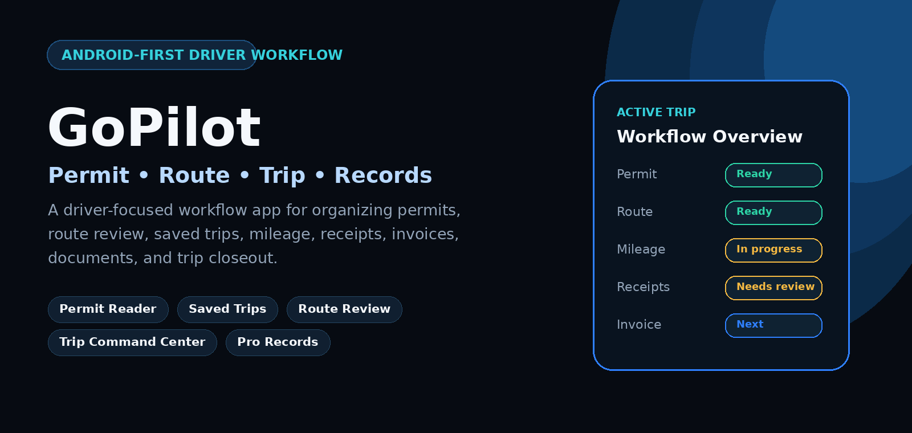
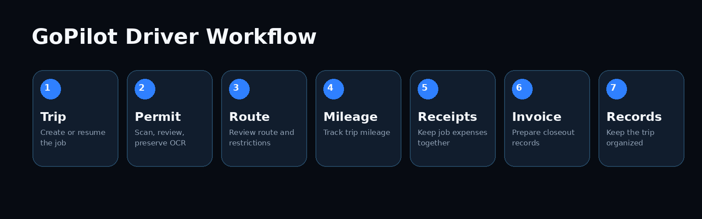

# GoPilot

**Driver workflow, permit review, trip organization, and business records — in one app.**

## What is GoPilot?

GoPilot is an Android-first driver workflow app built to keep the parts of a trip connected instead of scattered across photos, notes, messages, and separate tools.

The app centers around a practical workflow:

**Trip → Permit → Route → Mileage → Receipts → Invoice → Records**

GoPilot is designed for truckers, hotshot drivers, owner-operators, small fleets, and pilot/escort workflows where trip organization and document review matter.

> GoPilot is an organization and review tool. It does **not** replace official permits, DOT/state requirements, posted signs, carrier policy, dispatch instructions, or professional judgment.

## Public feature overview

### Permit Reader
- Permit photo and document workflow
- Multi-page permit handling
- OCR-assisted text extraction
- Cleaner route extraction
- Original OCR text preserved separately for review
- Permit comparison/revision workflow
- Manual review remains part of the process

### Saved Trips
- Active trip workflow
- Stable trip identity
- Multiple permits per trip
- Route notes and trip details
- Mileage, receipt, invoice, and record linking
- Trip status, archive, duplicate-trip, and workflow progress tools

### Trip Command Center
- Trip workflow progress
- Recommended next step
- Permit / route / mileage / receipt / invoice workflow awareness
- Resume active trip flow

### Driver and business records
- Mileage records
- Receipt / expense records
- Invoice records
- Trip business summary
- Trip closeout organization
- Optional GoPilot Pro workflow tools

## Current public project status

This repository is a **public product showcase and documentation repository**.

The production application source code is intentionally private and is **not included here**.

The latest verified development evidence represented in this repository is for the GoPilot **1.2.0 build 177 development line**:
- 24 automated Flutter tests passed
- `flutter analyze` returned **No issues found**
- Release APK build completed successfully
- Device installation and launch completed successfully

Development builds are not the same thing as a public store release. See [Development Status](docs/DEVELOPMENT_STATUS.md).

## Why the source is private

GoPilot is a commercial mobile application. Keeping the production source private helps protect:
- application implementation details
- signing and release infrastructure
- third-party service configuration
- anti-abuse logic
- commercial product IP

This repository contains public-safe documentation, graphics, release summaries, and project information only.

See [Public Repository Boundary](PUBLIC_REPO_BOUNDARY.md).

## Screenshots

Only screenshots approved for public use should be placed in `assets/screenshots/approved/`.

Before publishing screenshots, remove or obscure:
- real permit numbers
- names and phone numbers
- addresses
- VINs / unit numbers when sensitive
- invoices, customer information, and payment details
- account information
- notification content
- internal/debug information

See [Screenshot Guidelines](docs/SCREENSHOT_GUIDELINES.md).

## Security

Do **not** submit credentials, tokens, private permit documents, customer data, or exploit details through public GitHub issues.

See [SECURITY.md](SECURITY.md).

## Repository contents

- `docs/` — public product and development documentation
- `assets/` — public-safe project graphics and approved screenshots
- `.github/` — issue templates and public-repository safety checks
- `AGENTS.md` — hard rules for Codex/AI agents working in this repository
- `PUBLIC_REPO_BOUNDARY.md` — what must never be committed

## Platform

- Android: available / actively maintained
- iPhone / iOS: in progress

## Ownership

GoPilot is an independently developed product. Application source and commercial implementation remain proprietary.

---

**Always compare permit-derived information with the official permit and current applicable requirements before travel.**
